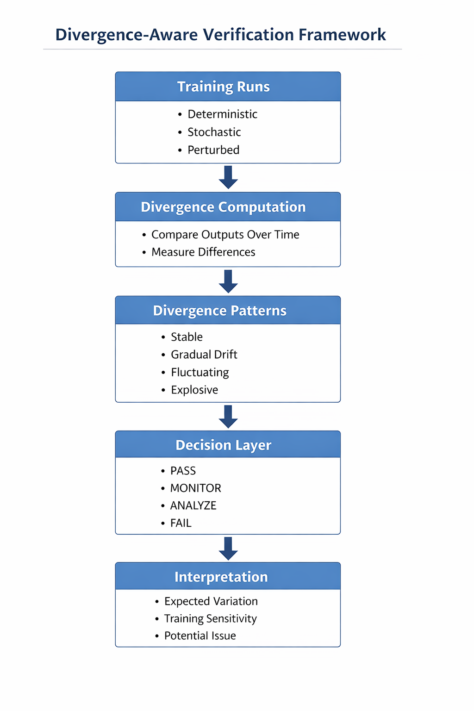

# OpenVerifiableLLM Experiments

This repository explores how small variations during training affect model behavior and reproducibility.

## Overview

The goal of this work is to analyze divergence in training trajectories and understand when differences between runs indicate normal variation versus actual inconsistencies.

## Key Contributions

- Comparison of deterministic vs stochastic training
- Tracking divergence across training steps
- Classification of divergence patterns:
  - Stable
  - Gradual Drift
  - Fluctuating
  - Explosive
- Simple decision framework for interpreting divergence

## Key Observations

- Deterministic runs remain stable across training  
- Stochastic runs show structured but non-monotonic divergence  
- Optimizer choice significantly affects divergence behavior  
- Small perturbations can compound over time  

These observations suggest that divergence is not random and should be interpreted based on behavior rather than strict numerical matching.

## Key Insight

Not all divergence means failure.

Different divergence behaviors reflect different underlying causes, so verification systems should consider training dynamics rather than relying only on exact numerical matching.

## Motivation

In systems like OpenVerifiableLLM, ensuring reproducibility is critical. This work helps define what kinds of variation are acceptable and what might indicate deeper issues.
